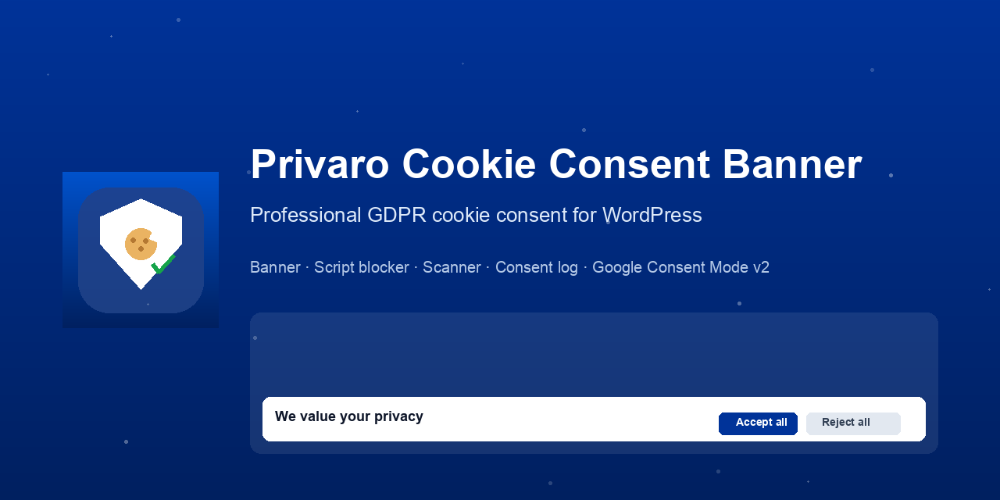
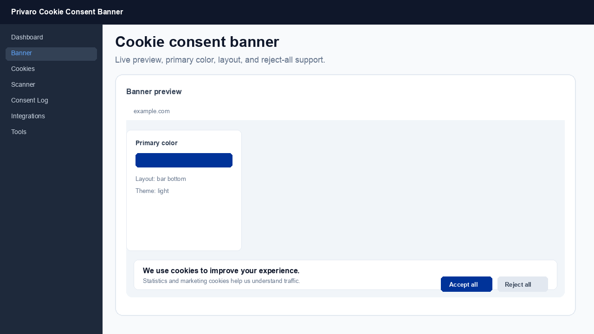
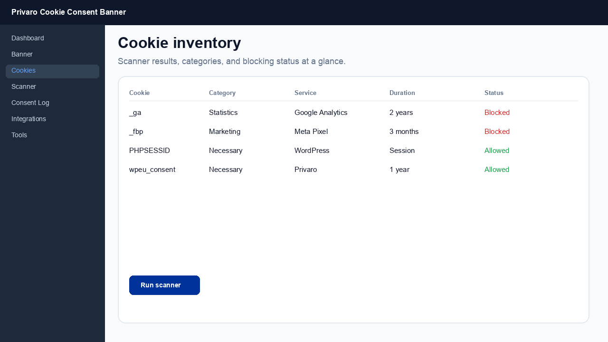
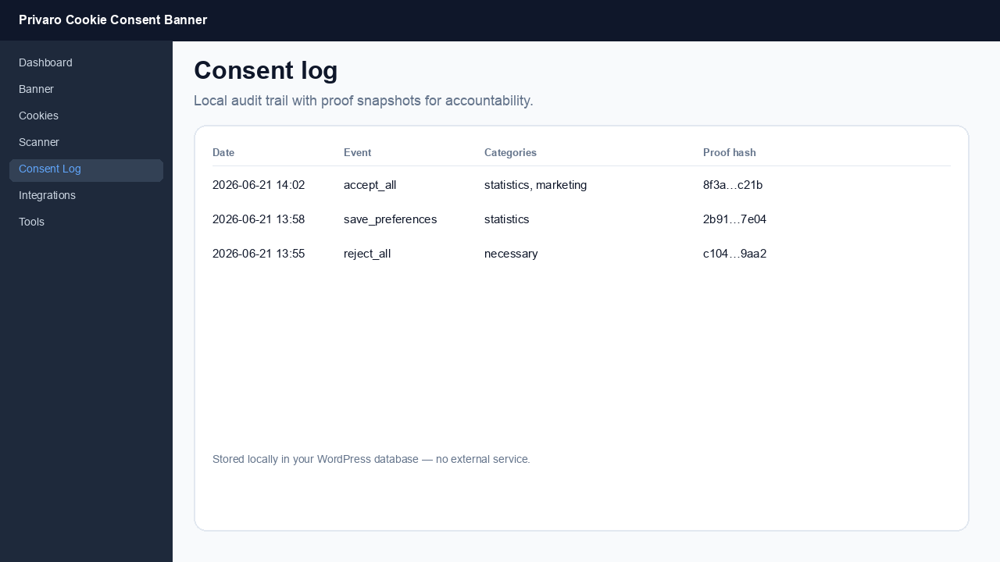
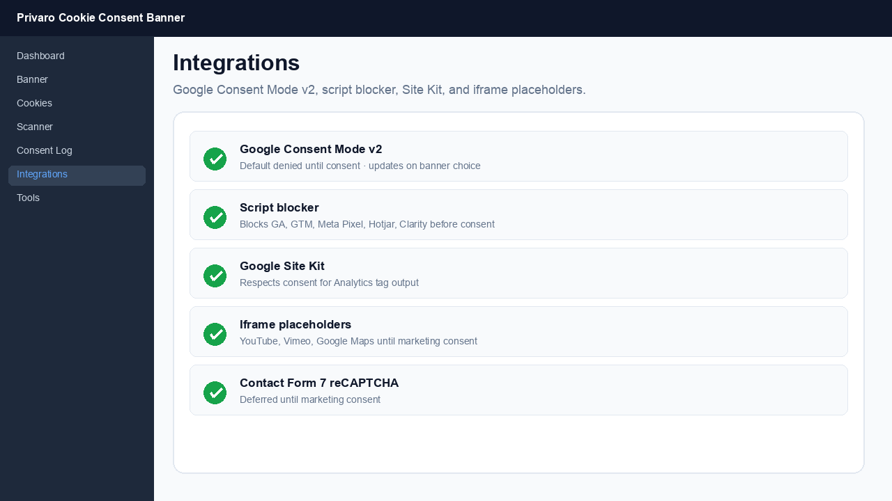

# Privaro Cookie Consent Banner

<p align="center">
  
</p>

<p align="center">
  <strong>GDPR-ready cookie consent for WordPress</strong><br>
  Banner · script blocking · cookie scanner · consent log · Google Consent Mode v2
</p>

<p align="center">
  <a href="https://github.com/EvgeniSasim/wp-eu-cookie-suite/actions/workflows/ci.yml"></a>
  <a href="LICENSE"></a>
  <a href="composer.json"></a>
  <a href="privaro-cookie-consent-banner/readme.txt"></a>
  <a href="https://wordpress.org/plugins/privaro-cookie-consent-banner/"></a>
</p>

<p align="center">
  <a href="https://wordpress.org/plugins/privaro-cookie-consent-banner/"><strong>Install from WordPress.org</strong></a>
  &nbsp;·&nbsp;
  <a href="https://github.com/EvgeniSasim/wp-eu-cookie-suite/releases">Releases</a>
  &nbsp;·&nbsp;
  <a href="CONTRIBUTING.md">Contributing</a>
  &nbsp;·&nbsp;
  <a href="SECURITY.md">Security</a>
</p>

<p align="center">
  
</p>

---

**Privaro Cookie Consent Banner** is an open-source WordPress plugin for EU/GDPR cookie compliance. It combines a modern [CookieConsent v3](https://github.com/orestbida/cookieconsent) banner, automatic script blocking, a built-in cookie scanner, optional consent logging, and native **Google Consent Mode v2** support — without locking core features behind a paywall.

| | |
|---|---|
| **Plugin folder** | `privaro-cookie-consent-banner/` |
| **WordPress.org** | [privaro-cookie-consent-banner](https://wordpress.org/plugins/privaro-cookie-consent-banner/) |
| **Changelog** | [CHANGELOG.md](CHANGELOG.md) |
| **Breaking changes** | [BREAKING_CHANGES.md](BREAKING_CHANGES.md) |

## Why Privaro?

Most cookie plugins either oversimplify compliance or bundle heavyweight CMP stacks. Privaro focuses on what WordPress sites actually need:

- **Opt-in by default** for EU visitors — *Reject all* is as visible as *Accept all*
- **Real blocking** — third-party scripts and embeds stay off until consent is granted
- **Transparency** — cookie inventory, policy shortcodes, and optional local consent log
- **Integrations that matter** — WP Consent API, Google Consent Mode v2, Google Site Kit, Contact Form 7
- **Multisite-ready** — network defaults with per-site override

> **Disclaimer:** This plugin provides technical tools for cookie compliance. It is **not legal advice**. You are responsible for policy texts and regulatory compliance in your jurisdiction.

## Features

| Area | What you get |
|------|----------------|
| **Banner** | CookieConsent v3 UI, light/dark themes, bar or box layout, live admin preview |
| **Categories** | Necessary, Preferences, Statistics, Marketing + custom categories |
| **Script blocker** | Output buffering blocks GA4, GTM, Meta Pixel, Hotjar, Clarity, and custom rules |
| **Embeds** | YouTube, Vimeo, and Google Maps placeholders until marketing consent |
| **Scanner** | Crawls your site via WP HTTP API and builds a categorized cookie inventory |
| **Consent log** | Optional local audit trail with proof snapshots (no external service) |
| **Google** | Consent Mode v2 defaults + updates; Site Kit tag blocking integration |
| **WordPress** | WP Consent API polyfill, Polylang/WPML-friendly banner texts, multisite network settings |
| **Tools** | JSON settings export/import, CSV cookie inventory export |

## Screenshots

<table>
  <tr>
    <td width="50%"><br><sub>Customizable banner with reject-all and live preview</sub></td>
    <td width="50%"><br><sub>Cookie inventory and scanner</sub></td>
  </tr>
  <tr>
    <td width="50%"><br><sub>Local consent log for accountability</sub></td>
    <td width="50%"><br><sub>Google Consent Mode v2 and integrations</sub></td>
  </tr>
</table>

## Quick start (5 minutes)

After installation, open **Privaro Cookie Consent Banner** in the WordPress admin:

1. **Banner** — set primary color, layout, and texts (EN/DE included; extend via filters or Polylang/WPML).
2. **Integrations** — enable *Google Consent Mode v2* and *Script blocker* if you use analytics or ads.
3. **Scanner** — run a scan, review results, and save cookies to the inventory.
4. **Pages** — add `[wpeu_cookie_policy]` and/or `[wpeu_cookie_declaration]` to your privacy/cookie pages.
5. **Footer** — add `[wpeu_manage_consent]` so visitors can reopen settings anytime.
6. **Verify** — open the site in a private window: no `_ga` / GTM / Pixel until you accept statistics/marketing.

## Installation

### Recommended: WordPress.org

1. In wp-admin go to **Plugins → Add New**.
2. Search for **Privaro Cookie Consent Banner**.
3. Click **Install Now**, then **Activate**.

Or install directly: [wordpress.org/plugins/privaro-cookie-consent-banner](https://wordpress.org/plugins/privaro-cookie-consent-banner/)

### Manual install

1. Download the latest release ZIP from [GitHub Releases](https://github.com/EvgeniSasim/wp-eu-cookie-suite/releases)  
   *or* copy the `privaro-cookie-consent-banner/` folder from this repository.
2. Upload to `wp-content/plugins/privaro-cookie-consent-banner/`.
3. Activate under **Plugins**.

Development symlink:

```bash
ln -s "$(pwd)/privaro-cookie-consent-banner" /path/to/wordpress/wp-content/plugins/privaro-cookie-consent-banner
```

### Multisite

Network-activate the plugin, then configure defaults under **Network Admin → Privaro Cookie Consent Banner**. Each site can inherit network settings or override them locally.

### Build from source (optional)

Pre-built frontend assets are included. Rebuild only if you change CookieConsent sources:

```bash
cd privaro-cookie-consent-banner
npm install
npm run build
```

Node.js is **not** required on production servers.

## Configuration guide

### Privacy & cookie pages

| Shortcode | Purpose |
|-----------|---------|
| `[wpeu_cookie_policy]` | Cookie policy content block |
| `[wpeu_cookie_declaration]` | Dynamic cookie table from inventory |
| `[wpeu_manage_consent]` | “Cookie settings” link or button in footer |

Example footer link:

```
[wpeu_manage_consent]
[wpeu_manage_consent style="button" label="Cookie settings"]
```

### Google Analytics / Tag Manager

1. Enable **Google Consent Mode v2** and **Script blocker** under **Integrations**.
2. Confirm tags are blocked in a private window before consent.
3. If you use **Google Site Kit**, the plugin coordinates tag output with consent state.

### Consent logging

Enable under **Consent Log** when you need a local audit trail. Data stays in your database (`wp_wpeu_consent_log`). Configure retention in settings. No data is sent to Privaro or third parties.

## FAQ

### Does the plugin work without Complianz or another CMP?

Yes. Privaro is a standalone plugin. You can migrate from Complianz manually — see [Migration checklist](#migrating-from-complianz) below.

### Is consent opt-in for EU visitors?

Yes. Marketing and statistics categories are off until the visitor accepts them (EU mode). *Reject all* must remain available — the banner is built for that.

### Does it block YouTube and Google Maps?

Yes. Embeds are replaced with placeholders until **Marketing** consent. Same for Vimeo.

### Where is consent stored?

In first-party cookies on the visitor's browser. Optional consent log records are stored in your WordPress database only.

### Does it support Google Consent Mode v2?

Yes. Default consent is `denied` for ad/analytics storage until the user chooses. Updates fire when the banner records a choice.

### Multilingual sites?

Banner strings can be edited per language in settings. Filters and Polylang/WPML integrations are supported for translated frontends.

### Multisite?

Yes. Network-wide defaults with per-site inherit/override. Scanner, cookie inventory, and consent log remain editable on subsites when inheriting.

### Does it phone home or use external scanners?

No. The scanner fetches **your own site URLs** via the WordPress HTTP API. The plugin does not load third-party scripts by itself.

### Can I export settings between sites?

Yes. **Tools → Export/Import JSON** moves Privaro settings between instances (not from other CMP plugins).

### What PHP and WordPress versions are required?

PHP **8.1+** and WordPress **6.4+**. Tested up to WordPress 7.0.

## Migrating from Complianz

There is no automatic importer. Use this checklist on **staging** first:

1. Install Privaro; keep Complianz active until verified.
2. Map categories: Functional → Necessary, Statistics → Statistics, Marketing → Marketing.
3. Copy custom script rules to **Integrations → Custom block rules**.
4. Set privacy/cookie policy URLs in **Banner**.
5. Replace policy shortcodes with `[wpeu_cookie_policy]` / `[wpeu_cookie_declaration]`.
6. Run the **Scanner** and merge into inventory.
7. Test banner, Consent Mode, Site Kit, and forms (e.g. CF7 reCAPTCHA → marketing).
8. Deactivate Complianz only after a clean pass.

## Development

```bash
composer install
bin/install-wp-tests.sh wordpress_test root '' localhost latest
vendor/bin/phpunit
```

| | |
|---|---|
| Architecture | [docs/architecture.md](docs/architecture.md) |
| Product spec | [docs/product-spec.md](docs/product-spec.md) |
| Custom categories | [docs/custom-categories.md](docs/custom-categories.md) |
| WordPress.org release | [docs/wordpress-org-submission.md](docs/wordpress-org-submission.md) |

## Author

**Evgenii Sasim** — [GitHub](https://github.com/EvgeniSasim) · [WordPress.org profile](https://profiles.wordpress.org/evgenij347/)

## License

[GPL-2.0-or-later](LICENSE). Bundled libraries: [THIRD-PARTY.md](privaro-cookie-consent-banner/THIRD-PARTY.md).

Issues, pull requests, and [responsible security reports](SECURITY.md) are welcome. See [CONTRIBUTING.md](CONTRIBUTING.md) and [CODE_OF_CONDUCT.md](CODE_OF_CONDUCT.md).
